# Alkalmazások fejlesztése beadandó
##HouseholdBudgets
###### Készítette: Dobos Árpád (MW05PC)
###Követelményanalízis
####Feladat és célkitűzés

A program célja egy egyszerű háztartás költségvetésének nyomonkövetése. Az adatok védelme érdekében regisztráció szükséges.
A fő feladatok: bevétel/kiadás rögzítése, módosítása, törlése, háztartás bevételének/kiadásának listázása.

####Funkcionális követelmények:
- **Adminisztrátorként:**
	* Bejelentkezés a főoldalon
	* Jelszó megváltoztatása
	* Új háztartás létrehozása
	* Háztartás törlése
	* Új lakó regisztrálása
	* Lakó hozzárendelése egy háztartáshoz
	* Lakó törlése
	* Kijelentkezése
  
- **Lakóként:**
  * Bejelentkezés a főoldalon
  * Jelszó megvátoztatása
  * Bevétel hozzáadása/törlése/módosítása
  * Kiadás hozzáadása/törlése/módosítása
  * Bevétel/kiadása listázása
  * Kijelentkezés
  
####Nem funkcionális követelmények:
- Ergonomikus elrendezése, felhasználóbarát felület
- Könnyen megérthető és elsajátítható működés
- Biztonságos, jelszóval védett adatok
- Könnyen karbantartható és bővíthető
- Egyértelmű hibajelzések
- Gyors működés

####Szakterületi fogalomjegyzék:
- **Háztartás:** azon személyek összessége, amelyek egy fogyasztói közösséget alkotnak és költségeiket közösen viselik
- **Lakó:** az a természetes személy, aki az adott háztartásban életvitelszerűen él

####Osztálymodell

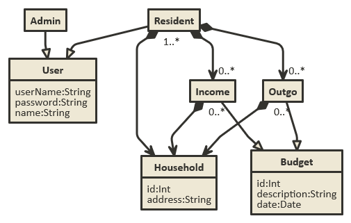

####Használatieset-modell, szerepkörök
- **Közös tulajdonságok:** Bejelentkezés, jelszó módosítása, kijelentkezés
- **Admin:** Új lakó beregisztrálása/trölése, lakó hozzárendelése egy háztartáshoz, háztartás létrehozása/törlése/módosítása
- **Lakó:** Adatok módosítása, bevétel létrehozása/módosítása/törlése, kiadás létrehozása/módosítása/törlése, bevétel/kiadás listázása

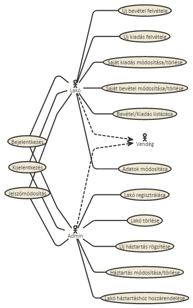

####Példa egy folyamatra:
Lakóként egy új kiadást hozunk létre:

1. Egy felhasználó a főoldalról bejelentkezik lakóként
2. A kiadásoknál a megadja az adatokat majd jóváhagyja a módosításokat
3. Ha nem sikerült a kiadás létrehozása akkor javítja a hibákat
4. A kiadás létrehozása után létrehozhat többet is
5. Kijelentkezése

###Tervezése
####OldalTérkép
- **Publikus:**
	* Bejelentkezés
- **Bejelentkezett:**
	* Főoldal
		* Adminisztrátor:
			* Lakók
			* Háztartások
		* Lakó:
			* Bevétel/kiadás listája
	* Lakók
		* Adminisztrátor:
			* Új lakó felvétele
			* Lakó törlése
			* Lakó háztartáshoz rendelése
	* Háztartások:
		* Adminisztrátor:
			* Új háztartás létrehozása
			* Háztartás törlése
	* Bevételek/Kiadások:
		* Lakó:
			* Új létrehozása
			* Módosítás
			* Törlés
			
####Végpontok
- GET/login: bejelentkező oldal
- POST/login: bejelentkező adatok elküldése
- GET/logout: kijelentkező oldal
- GET/: főoldal
- GET/bevetel/list: betvétel kilistázása
- GET/kiadas/list: kiadas kilistázása
- GET/lako/list: lakók kilistázása
- GET/lako/new: új lakó felvétele
- POST/lako/new: új lakó felvételéhez szükséges adatok elküldése
- GET/lako/edit=id: lakó adatainak módosítása
- POST/lako/edit=id: lakó adatainak módosításához szükséges adatok elküldése
- GET/haztartas/new: új háztartás létrehozása
- POST/haztartas/new: új háztartás adatainak elküldése
- GET/haztartas/edit=id: háztartás adatainak módosítása
- POST/haztartas/edit=id: háztartás adatainak módosításához szükséges adatok elküldése
- GET/bevetel/new: új bevétel létrehozása
- POS/bevetel/new: új bevétel létrehozásához szükséges adatok elküldése
- GET/bevetel/edit=id: bevetel módosítása
- POST/bevetel/edit=id: bevétel módosításához szükséges adatok elküldése
- GET/kiadás/new: új kiadás létrehozása
- POS/kiadás/new: új kiadas létrehozásához szükséges adatok elküldése
- GET/kiadas/edit=id: kiadas módosítása
- POST/kiadas/edit=id: kiadas módosításához szükséges adatok elküldése
- GET/profil: felhasználói adatok
- POST/profil: felhasználói adatok elküldése

####Oldalvázlatok

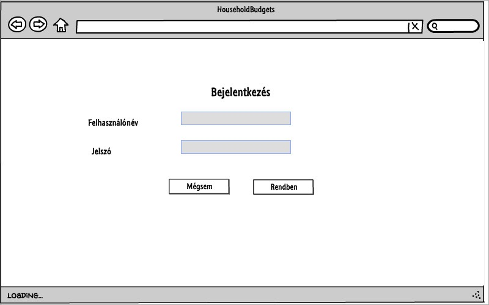

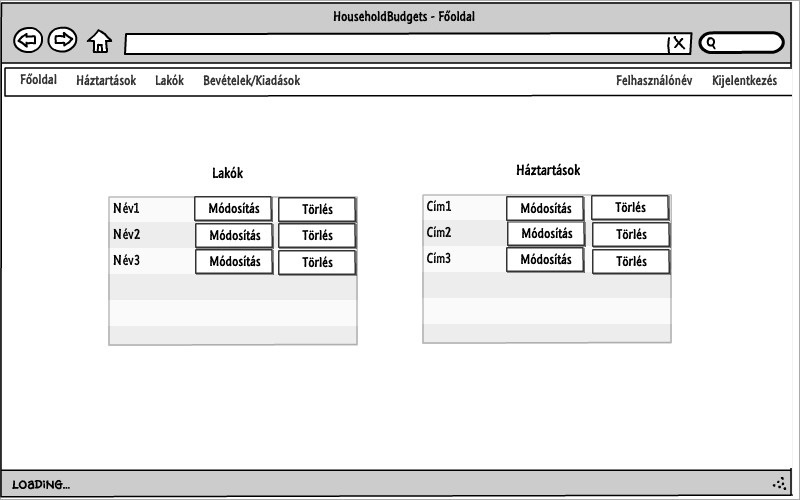

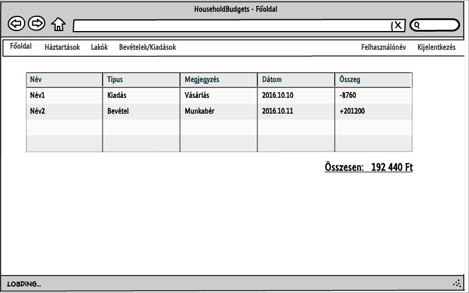

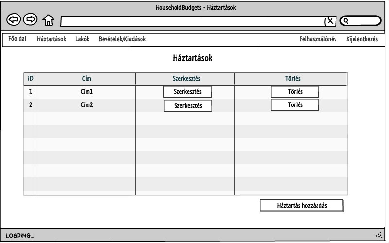

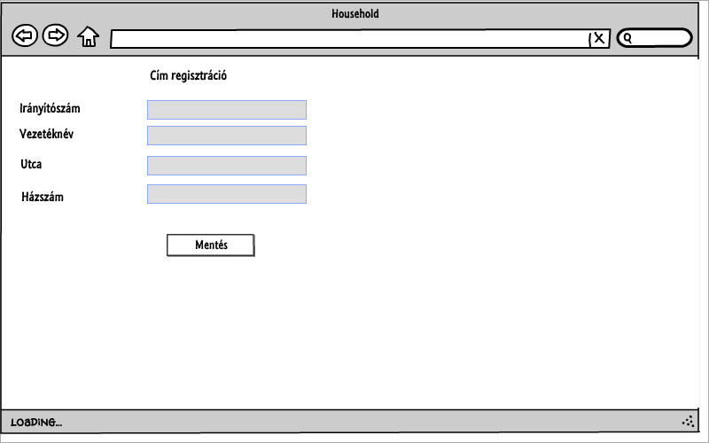

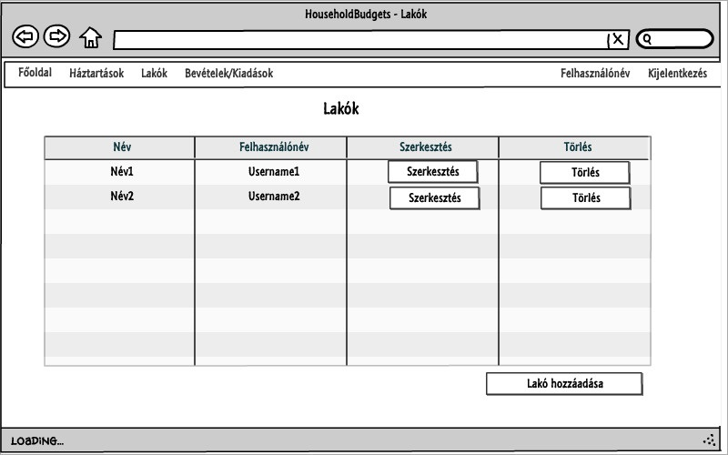

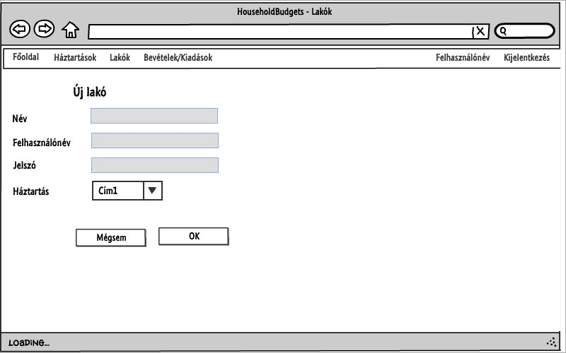

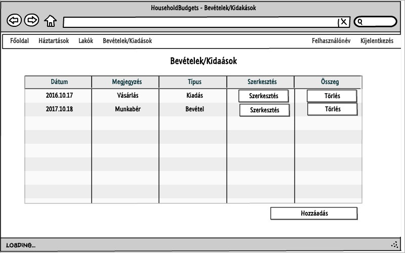

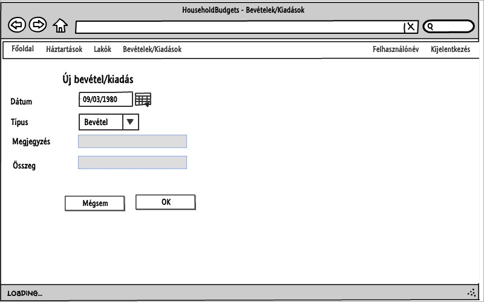

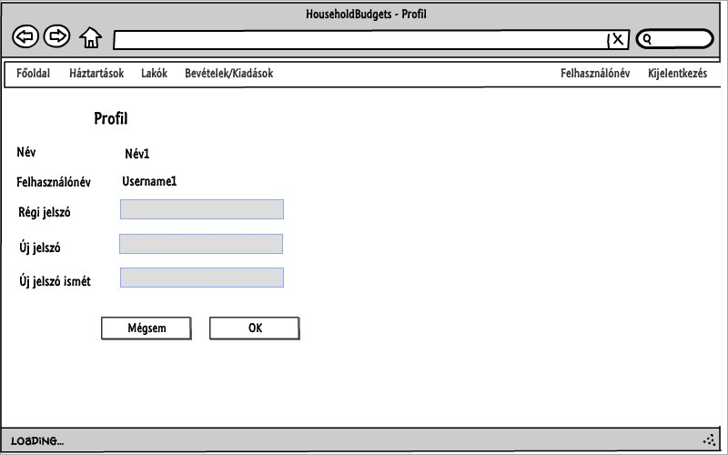