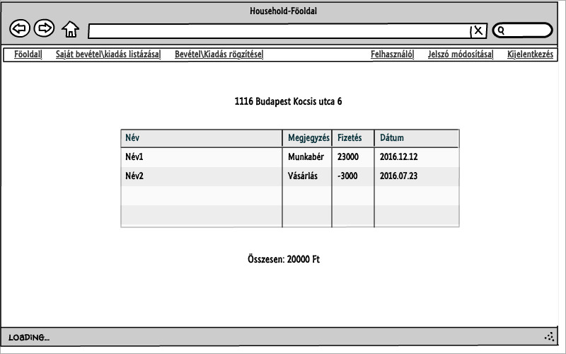

# Alkalmazások fejlesztése beadandó
##HouseholdBudgets
###### Készítette: Dobos Árpád (MW05PC)
###Követelményanalízis
####Feladat és célkitűzés

A program célja egy egyszerű háztartás költségvetésének nyomonkövetése. Az adatok védelme érdekében regisztráció szükséges.
A fő feladatok: bevétel/kiadás rögzítése, módosítása, törlése, háztartás bevételének/kiadásának listázása.

####Funkcionális követelmények:
- **Adminisztrátorként:**
	* Bejelentkezés a főoldalon
	* Jelszó megváltoztatása
	* Új háztartás létrehozása
	* Háztartás törlése
	* Új lakó regisztrálása
	* Lakó hozzárendelése egy háztartáshoz
	* Lakó törlése
	* Kijelentkezése
  
- **Lakóként:**
  * Bejelentkezés a főoldalon
  * Jelszó megvátoztatása
  * Bevétel hozzáadása/törlése/módosítása
  * Kiadás hozzáadása/törlése/módosítása
  * Bevétel/kiadása listázása
  * Kijelentkezés
  
####Nem funkcionális követelmények:
- Ergonomikus elrendezése, felhasználóbarát felület
- Könnyen megérthető és elsajátítható működés
- Biztonságos, jelszóval védett adatok
- Könnyen karbantartható és bővíthető
- Egyértelmű hibajelzések
- Gyors működés

####Szakterületi fogalomjegyzék:
- **Háztartás:** azon személyek összessége, amelyek egy fogyasztói közösséget alkotnak és költségeiket közösen viselik
- **Lakó:** az a természetes személy, aki az adott háztartásban életvitelszerűen él

####Osztálymodell

####Használatieset-modell, szerepkörök
- **Közös tulajdonságok:** Bejelentkezés, jelszó módosítása, kijelentkezés
- **Admin:** Új lakó beregisztrálása/trölése, lakó hozzárendelése egy háztartáshoz, háztartás létrehozása/törlése/módosítása
- **Lakó:** Adatok módosítása, bevétel létrehozása/módosítása/törlése, kiadás létrehozása/módosítása/törlése, bevétel/kiadás listázása

####Példa egy folyamatra:
Lakóként egy új kiadást hozunk létre:

1. Egy felhasználó a főoldalról bejelentkezik lakóként
2. A kiadásoknál a megadja az adatokat majd jóváhagyja a módosításokat
3. Ha nem sikerült a kiadás létrehozása akkor javítja a hibákat
4. A kiadás létrehozása után létrehozhat többet is
5. Kijelentkezése

###Tervezése
####OldalTérkép
- **Publikus:**
	* Bejelentkezés
- **Bejelentkezett:**
	* Főoldal
		* Adminisztrátor:
			* Háztartások listázása
			* Felhasználó adatainak módosítása
		* Lakó:
			* Saját bevétel/kiadás listázása
			* Bevétel/kiadás rögzítése 
	* Háztartások listázása:
		* Adminisztrátor:
			* Háztartás törlése
			* Háztartás szerkesztése
	* Saját bevételek/kiadások listázása:
		* Lakó:
			* Módosítás
			* Törlés
	* Bevétel/kiadás rögzítése:
		* Lakó:
			* Új bevétel/kiadás megadása
			
####Végpontok
User:
- GET/: bejelentkező oldal
- POST/: bejelentkező adatok elküldése
- GET/home: főoldal
- GET/registration: felhasználó regisztrálása
- POST/registration: felhasználó adatainak elküldése
- GET/logout: kijelentkezés
- GET/addressReg: cím regisztrálása
- POST/addressReg: lakás adatainak elküldése
- GET/newbudget/edit=id: új bevétel/kiadás rögzítése
- POST/newbudget/edit=id: új bevétel/kiadás adtai elküldése
- GET/showbudgets: felhasználó költségeinek listázása
- GET/editbudgets/edit=id: költség adatainak módosítása
- POST/editbudgets/edit=id: költség adatainak elküldése
- POST/delete/edit=id: költség törlése
- GET/editUser/edit=id: felhasználó adatainak módosítása
- POST/editUser/edit=id: felhasználó addatainak elküldése
- GET/changePassword/edit=id: jelszó módosítása
- POST/changePassword/edit=id: módosított jelszó elküldése

Admin:
- GET/changeUser/edit=id: kiválasztott felhasználó adatainak módosítása
- POST/changeUser/edit=id: felhasználó adatainak elküldése
- POST/changeUser/edit=id/delete: kiválasztott felhasználó törlése
- GET/listHouseholds: lakások kilistázása
- GET/editAddress/edit=id: lakás adatainak szerkesztése
- POST/editAddress/edit=id: lakás adataink elküldése
- POST/deleteAdm/edit=id: lakás törlése

Ajax:
- GET/search: felhasználó keresése a neve alapján (csak az admin oldalon elérhető)
- DELETE/ajax/delete/edit=id: költség törlése
- DELETE/ajax/changeUser/edit=id/delete: kiválasztott felhasználó törlése
- DELETE/ajax/deleteAdm/edit=id: lakás törlése

###Javascript

1. Bevétel\Kiadás összesítés
- **Megtalálható:** home.njk
- **Script:** sum.js
- **Leírás:** összesíti az adott lakás összes felhasználó bevételeit/kiadásait és a végösszeget kiírja az oldalon

2. Törlés
- **Megtalálható:** listHouseholds.njk, changeUser.njk, showbudgets.njk
- **Script:** show.js
- **Leírás:** amennyiben rákattintunk a törlés gombra egy figyelmeztető üzenet jelenik meg, ahol jóvá kell hagyni a törlést, de el is utasíthatjuk

3. Óra
- **Megtalálható:** parent.njk
- **Script:** clock.js
- **Leírás:** megjelenít az idő a menűsorban amit 0,5 másodpercenként frissít

4. Keresés
- **Megtalálható:** home.njk (csak adminként látható)
- **Script:** search.js
- **Leírás:** amint elkezdünk gépelni alatta megjeleníti azon felhasználókat akinek a nevében megtalálható a beírt szó

####Szekvencia diagram
Az alábbi szekvencia diagram szemlélteti egy felhasználó bejelentkezik, megkapja a bevételek/kiadások összegét,
kilistázza a költségeteket, szerkeszti azokat, új költséget rögzít végül pedig kijelentkezik

![] (Images/mockup/szekvencia.jpg)

####Oldalvázlatok

